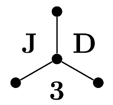

# 

J3D is a C library for fast and robust polyhedral intersections.<br>
It is based on R3D but without the restriction of degree 3 nodes.

LANL O4945

## Build instructions
```shell
cmake -B build \
  -D CMAKE_BUILD_TYPE=Release \
  -D ENABLE_UNIT_TESTS=ON \
  -D USE_CLANG_FORMAT=OFF \
  -D J3D_MAX_VERTS=256 \            # optional
  -D J3D_MAX_EDGES=512 \            # optional
  -D J3D_MAX_ORDER=5 \              # optional
  -D J2D_MAX_VERTS=256 \            # optional
  -D J2D_MAX_ORDER=5 \              # optional
  -D J3D_ENABLE_Kokkos=False \      # optional
  -D Kokkos_ROOT="/path/to/kokkos"  # optional
  -D CMAKE_INSTALL_PREFIX="/where/to/install/it"
cmake --build build/ -j 4
ctest --test-dir build/ --output-on-failure
cmake --install build/
```

## Acknowledgements
We gratefully acknowledge the LANL ASC program whos funding made this project possible.
We also acknowledge the `r3d` project by Devon Powell which this project is based on.

## Copyright
(c) 2025. Triad National Security, LLC. All rights reserved.
This program was produced under U.S. Government contract 89233218CNA000001
for Los Alamos National Laboratory (LANL), which is operated by Triad National
Security, LLC for the U.S. Department of Energy/National Nuclear Security
Administration. All rights in the program are reserved by Triad National Security,
LLC, and the U.S. Department of Energy/National Nuclear Security Administration.
The Government is granted for itself and others acting on its behalf a nonexclusive,
paid-up, irrevocable worldwide license in this material to reproduce, prepare.
derivative works, distribute copies to the public, perform publicly and display
publicly, and to permit others to do so.
